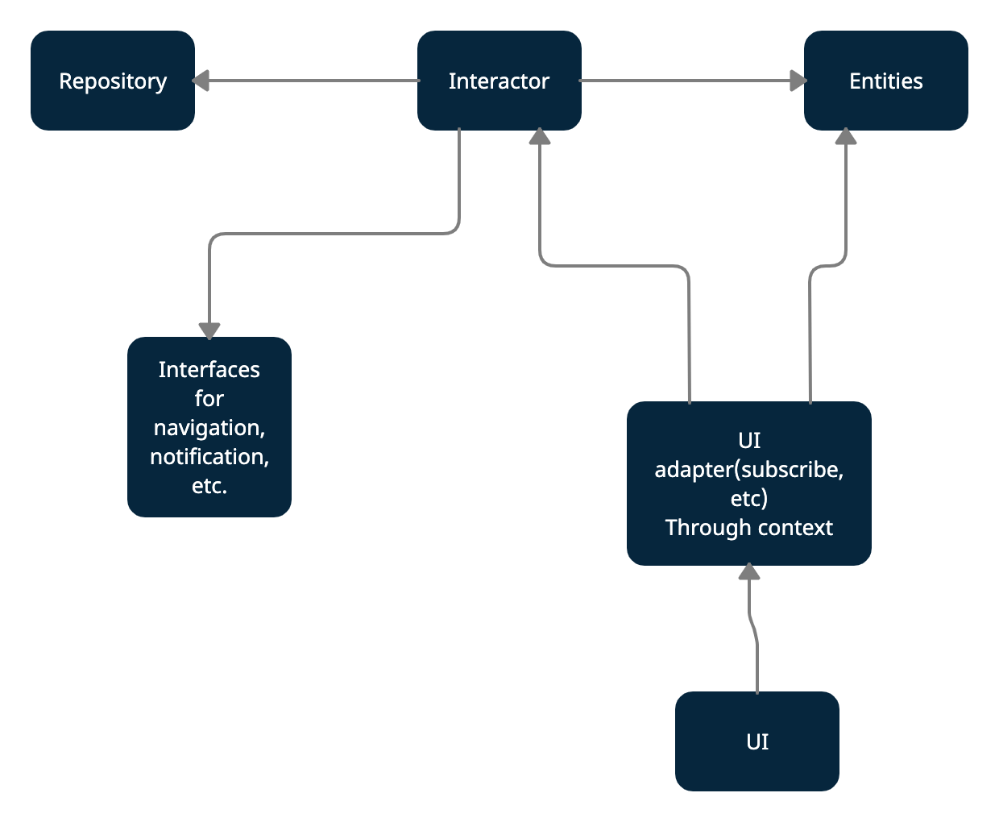
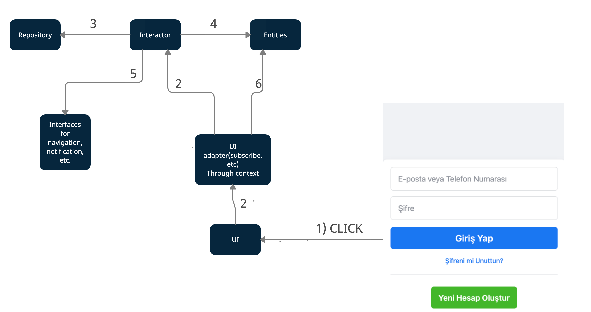

## Оглавление
- [Запуск проекта](#Запуск_проекта)
- [Работа с гитом](#Работа_с_гитом)
- [Стек на проекте](#Стек_на_проекте)
- [Архитектура](#Архитектура)

____
#  <a name="Запуск_проекта">Запуск проекта</a>

### Необходимая версия nodejs: >=16.0.0
Используйте `Node Version Manager` для установки версии nodejs

Документация по установки`Node Version Manager - [https://github.com/nvm-sh/nvm](https://github.com/nvm-sh/nvm)

## Доступные скрипты

#### `yarn install / yarn`
Установка зависимостей
#### `yarn start`
Запуск проекта на - [http://localhost:3000](http://localhost:3000)
#### `yarn test`
Запуск тестирования
#### `yarn build`
Создание билда

____
# <a name="Работа_с_гитом">Работа с гитом</a>

### Именование веток:
- Если это фича: `feature/DX-номер таски`, например `feature/DX-777`
- Если это багфикс: `bugfix/DX-номер таски`, например `bugfix/DX-777`

### Коммиты:
- `DX-номер таски: commit message.` Например: `DX-777: Add some feature.`

### Merge Requests:
- В заголовке: `DX-номер таски: общее сообщение(к примеру название задачи).` Например: `DX-777: Add some feature.`
- В описании: ссылка на таску

____
# <a name="Стек_на_проекте">Стек на проекте</a>

### Будет дополняться! (глава в разработке)

### Store
- Для кеширования мы используем - [@redux-toolkit](https://redux-toolkit.js.org/)
### Form
- Для форм мы используем - [Formik](https://formik.org/)
- Для валидации форм - [Yup](https://www.npmjs.com/package/yup)
### Request
Для запросов мы используем - [???? надо обсудить]
### Webpack improvements
- У нас используется CRA. Для взаимодействия с webpack и настройки конфигов используется [craco](https://www.npmjs.com/package/@craco/craco)
  (пример исп: настройка alias)
### Code style
- [Prettier](https://prettier.io/)
- Eslint / stylelint
### Style
- [Tailwindcss](https://tailwindcss.com/)
- Module style
- [Classnames](https://www.npmjs.com/package/classnames)
### Other Libs
- [Lodash](https://lodash.com/)

# <a name="Архитектура">Архитектура</a>

Базируется на "Чистой архитектуре" Роберта Мартина.

> Стрелочками указаны зависимости слоев друг от друга, к примеру, `Entities` не зависит не от чего, а `Interactor` имеет множество зависимостей.

В нашем приложении есть несколько слоев, каждый из которых имеет свою зону ответственности:
1) <b>`Entities`</b> - бизнес объекты приложения, так же являются состоянием.

Пример: объект пользователя, методы для его сохранения и сброса; массив каких-либо данных.

2) <b>`Interactor`</b> - сценарии приложения.

Пример: мы нажимаем на условную кнопку "Отправить" в интерфейсе и вызываем в хендлере метод `Interactor`,
который запускает примерно следующий сценарий:
- устанавливает флаг `isLoading` в true
- достает данные из `Repository`
- в зависимости от статуса ответа или сохраняем данные, полученные из `Repository` или показываем пользователю уведомление об ошибке
- устанавливает флаг `isLoading` в false

3) <b>`Repository`</b> - централизованный слой для доступа к данным(API, localStorage, Cookie, etc).

Пример: в `Repository` инкапсулированы вызовы к API, доступ к хранилищам и тд, а так же в этом слое находятся адаптеры,
для того, чтобы в приложение данные входили в удобном нам виде.

4) <b>`UI`</b> - пользовательский интерфейс.

### Пример потока данных в представленной архитектуре на авторизации [Facebook](https://tr-tr.facebook.com/) (сори что на Турецком)

1) Пользователь кликает на кнопку "Войти" / "Giriş Yap"
2) Через адаптер, мы вызываем нужный нам метод слоя `Interactor`, в котором описан сценарий того, как должны развиваться события.
3) В сценарии `Interactor` мы обращаемся к `Repository`, чтобы получить от него данные пользователя, а тот в свою очередь через https запрашивает данные у бекенда.(Мы так же устаналиваем флаг загрузки(`isLoading` в `true`) в Entities)
4) После того как данные получены, мы сохраняем их в `Entities`.
5) Далее мы навигируем пользователя на главную страницу приложения. Меняем `isLoading` в `false`
6) Так как UI подписан на `Entities`, то после изменения `Entities` он будет перерисовываться в соответствии с ним. Конкретнее: после изменения флага `isLoading` кнопка "Войти" / "Giriş Yap" будет блокироваться.

